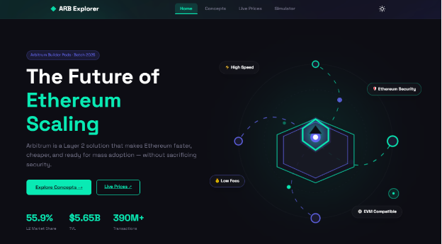
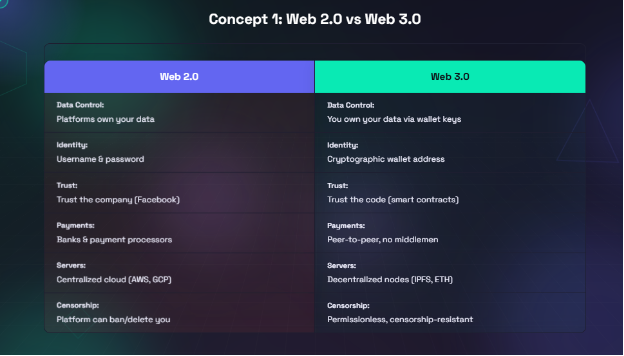
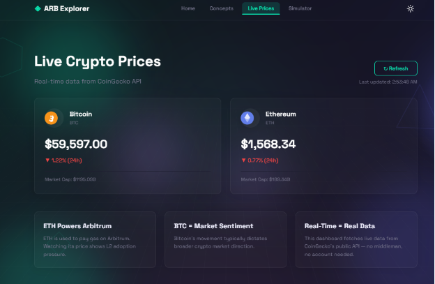
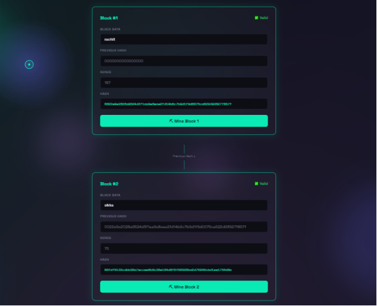

# ArbiChain Explorer

A 4-page educational website exploring Web3 concepts, built as part of the Arbitrum Builder Pods assignment by Lampros DAO.

## Pages
| Page | File | Description |
|------|------|-------------|
| Home | index.html | Arbitrum & Layer 2 overview with hero, stats, comparison |
| Concepts | concepts.html | Visual comparison cards for 4 core Web3 concepts |
| Live Prices | prices.html | Real-time ETH & BTC prices via CoinGecko API |
| Simulator | simulator.html | Interactive block mining simulator with SHA-256 |

## Tech Stack
- HTML5, CSS3, Vanilla JavaScript
- Web Crypto API (SHA-256 hashing)
- CoinGecko Public API
- Google Fonts: Space Grotesk + Space Mono

## Screenshots

### 🏠 Home

### 📚 Concepts

### 📈 Live Prices

### ⛏️ Block Simulator

## How to Run
1. Clone the repo
2. Open `index.html` in any browser

## Built By
Rachit Sikka · [GitHub](https://github.com/Rachitbyte) · Arbitrum Builder Pods · Lampros DAO

## Known Issues & Future Improvements

- CoinGecko free API has a rate limit (~30 req/min). 
  Refreshing too quickly may temporarily return an error state.
- Block mining simulator caps nonce at 1,000,000 iterations. 
  Difficulty is simulated (hash starts with "00"), not real Bitcoin PoW.
- ARB price may occasionally be unavailable from CoinGecko 
  free tier — fallback shows last known value.
- Future: Add more coins (SOL, MATIC) to the price dashboard.
- Future: Add adjustable mining difficulty (000, 0000) to simulator.
- Future: Deploy to Vercel for live URL instead of GitHub Pages.